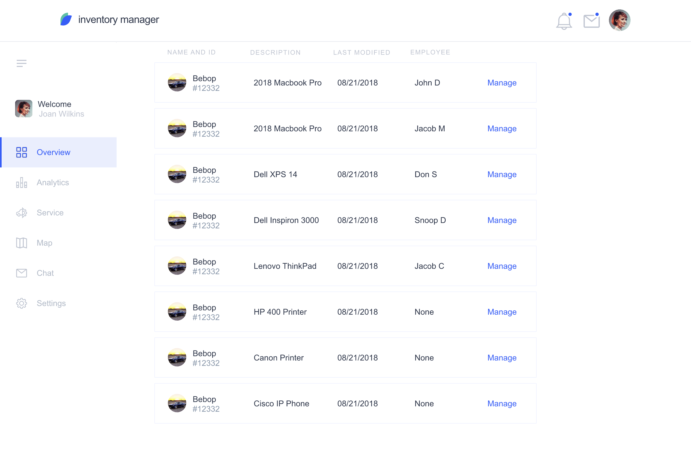

# InventoryManager [](https://github.com/reediculous456/InventoryManager/actions/workflows/maven.yml)

Design Document

Wes Reed, Matthew Saling, Daniel Cullen, and Christopher Elbe

## Introduction

Inventory Manager is an application for tracking your companies assets. This includes how many of each asset your company has and which employee has possession of each item.

## Storyboard

[Link to Storyboard](https://projects.invisionapp.com/prototype/ckz1n0yp4001nz50197yyo2fc/play)



## Requirements

* [Requirement 1: Create an Item](docs/requirements/Requirement1.md)
* [Requirement 2: Add to inventory](docs/requirements/Requirement2.md)
* [Requirement 3: Asset Management](docs/requirements/Requirement3.md)

## Class Diagram


[Download the Diagram File](docs/assets/uml.drawio) (open with [draw.io](https://draw.io))

### Class Diagram Description

[Link to Class Diagram Description](docs/uml-description.md)

## API JSON Schema

For our JSON API Schema we will have the ability to reach out via rest endpoint and get a list of items in inventory with who it's assigned to.
The JSON object will look like this:

```jsonc
{
  "unique_id": "string", // required
  "object_name": "string", // required
  "assigned_to": "string",
  "location": "string",
  "description": "string",
  "last_updated": "Date"
}
```

This will allow our users to be able to get data about the object, and search for objects containing specific information.

##Necessary Precautions For This Project

* Within the Maven tab, install the Maven Dependencies (Source & Documentation)

## Scrum Roles

* **Scrum Master, Product Owner, and Github Admin:** Wes Reed
* **UI Specialist:** Daniel Cullen
* **Business Logic and Persistence Expert:** Matthew Saling and Christopher Elbe

## Weekly Meetings

* [Standup Wednesday from 7 to 7:30](https://teams.microsoft.com/l/meetup-join/19%3ameeting_MmQ0Mzc0ZGQtZmVjMi00NGExLTlkNGYtOTc5OGFkOGUwMWRl%40thread.v2/0?context=%7b%22Tid%22%3a%22f5222e6c-5fc6-48eb-8f03-73db18203b63%22%2c%22Oid%22%3a%22e1b08e73-d2dd-449a-848e-db26cd974c04%22%7d)
